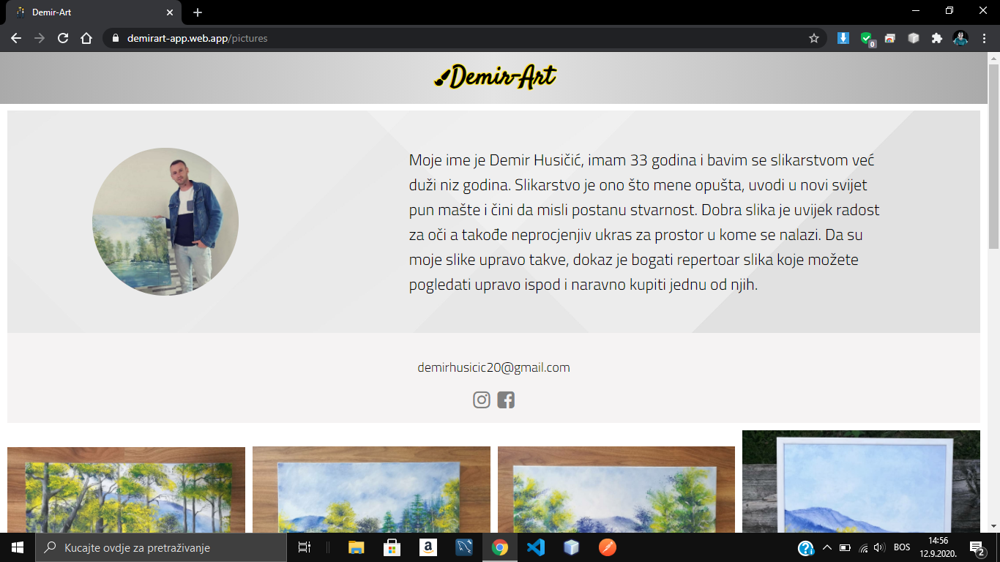
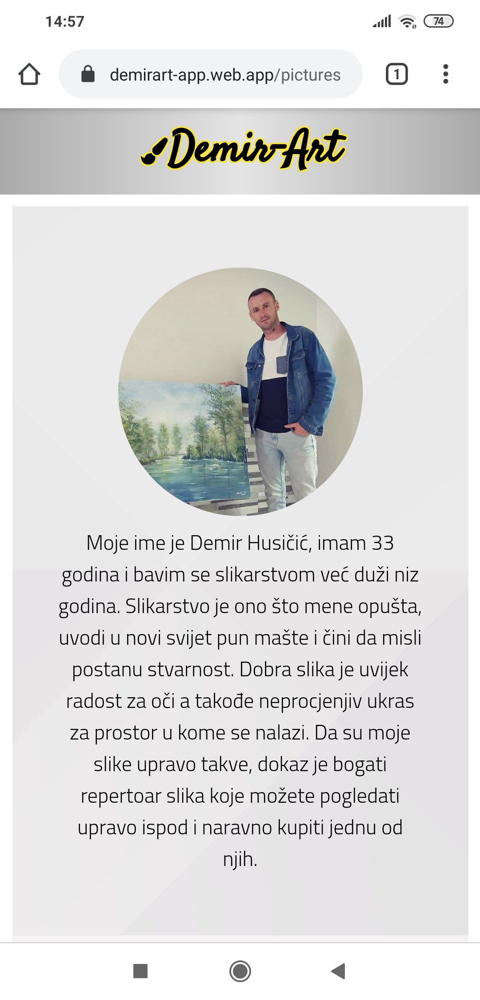
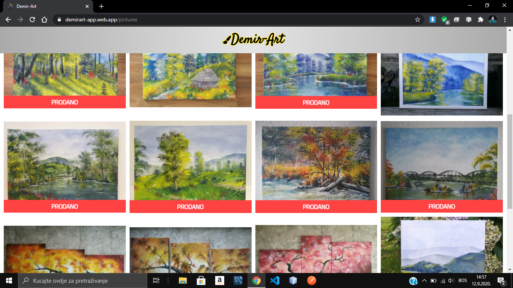
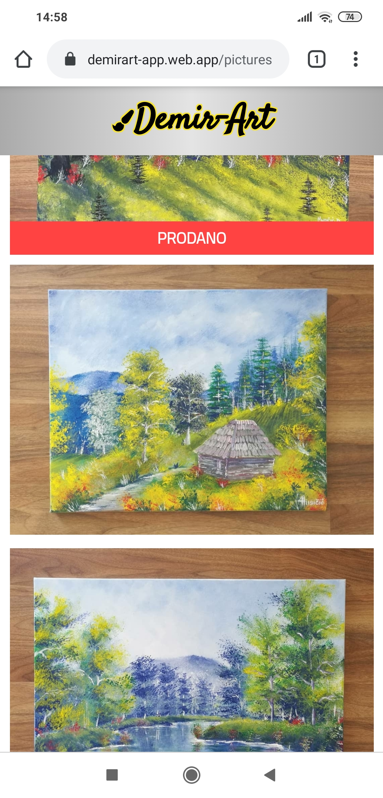

# Demir-Art-Angular

## This is the frontend part of the Demir-art application. 
The application is built using Angular with Typescript. The frontend itself is hosted on Firebase. 
Here is the link of the application itself. <a href="https://demirart-app.web.app" target="blank">Click here</a> 
And here is the link to the backend code. <a href="https://github.com/Imran-Sehic/Demir-Art-Spring-Boot" target="blank">Click here</a>  
Below are some of the screenshots of the application itself.  

&nbsp;&nbsp;&nbsp;&nbsp;&nbsp;&nbsp;
  

&nbsp;&nbsp;&nbsp;&nbsp;&nbsp;&nbsp;
  
